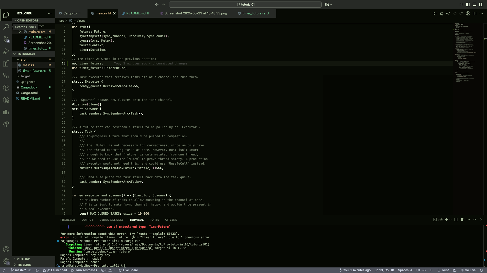
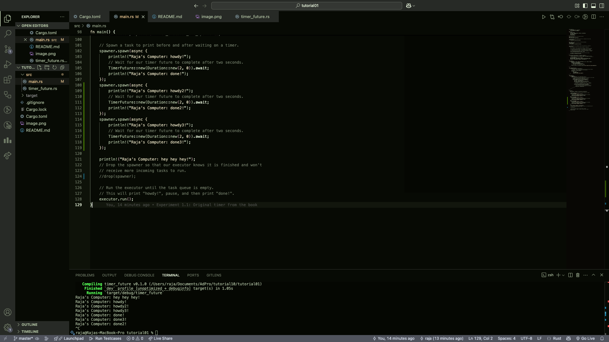
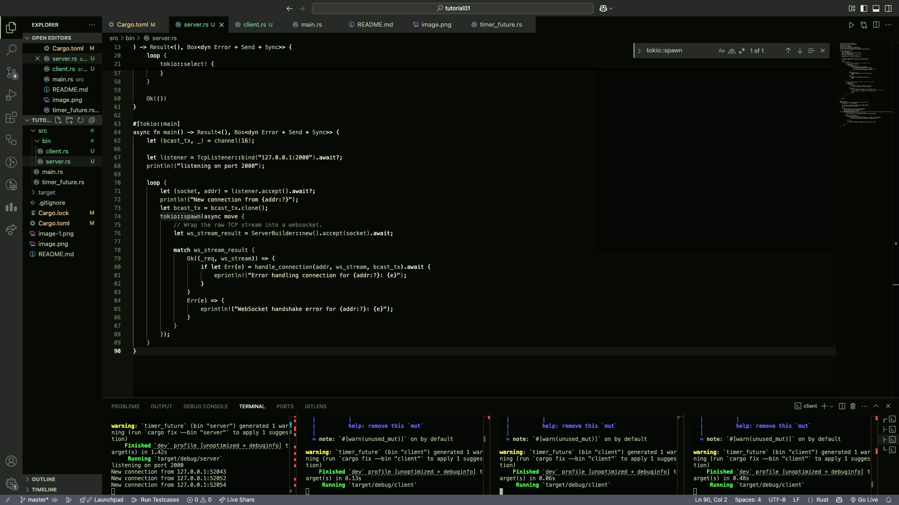
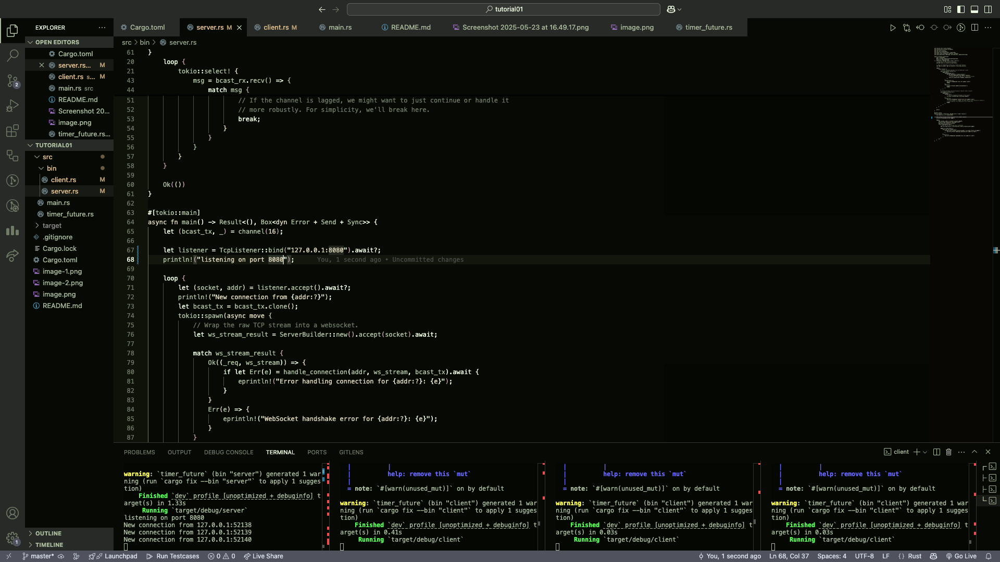
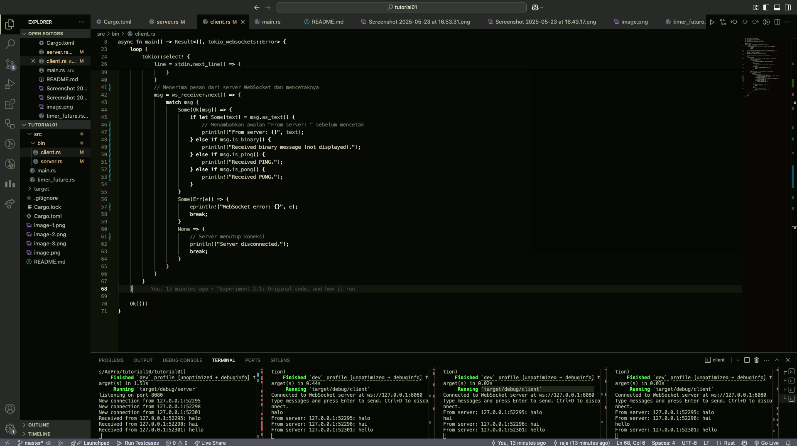

Penjelasan: Penambahan baris println!("Raja's Computer: hey hey hey!"); di dalam fungsi main() akan mencetak teks itu secara langsung setelah memanggil spawner.spawn(), dan sebelum eksekusi
asynchronous dimulai.

Penjelasan: Output program berbeda-beda karena ketiga task async (howdy, howdy2, howdy3) dijalankan secara bersamaan (concurrently).
Rust executor tidak menjamin urutan eksekusi antar task, sehingga hasil done, done2, dan done3 bisa muncul dalam urutan yang berubah-ubah setiap kali dijalankan.

Penjelasa: Program ini adalah contoh obrolan WebSocket dasar yang dibangun dengan Rust, menggunakan tokio untuk operasi asinkron. Cukup jalankan cargo run --bin server di satu terminal, lalu cargo run --bin client di beberapa terminal lain. Setiap kali mengetik pesan di salah satu klien dan menekan Enter, pesan itu akan dikirim ke server, yang kemudian menyiarkannya kembali ke semua klien yang terhubung, memungkinkan semua orang melihat pesan satu sama lain secara real-time.

Ini adalah update connection WebSocket dasar Rust. Jalankan cargo run --bin server (satu terminal) lalu cargo run --bin client (beberapa terminal). Port koneksi diubah ke 8080 di server dan klien. Protokolnya tetap WebSocket (ws://), ditangani oleh tokio-websockets. Ketik pesan di klien, tekan Enter, dan pesan akan disiarkan ke semua klien lain secara real-time.

Ini adalah modifikasi connection WebSocket Rust yang berjalan di port 8080 dan menggunakan protokol WebSocket. Untuk menjalankan, cukup buka satu terminal untuk cargo run --bin server dan beberapa terminal lain untuk cargo run --bin client. Sebagai modifikasi baru, server kini menetapkan ID unik (misalnya, Client #1) kepada setiap klien yang terhubung, dan setiap pesan yang disiarkan akan diawali dengan ID klien pengirim ini (perubahan di src/bin/server.rs). Ketika user mengetik pesan di klien, semua klien akan melihatnya dengan ID pengirim, mempermudah identifikasi.